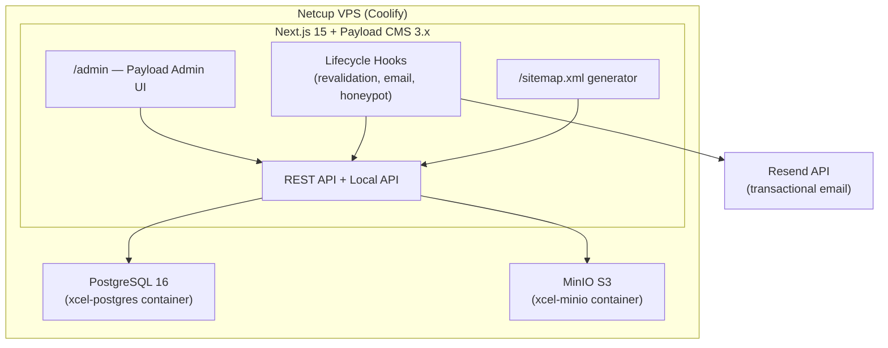
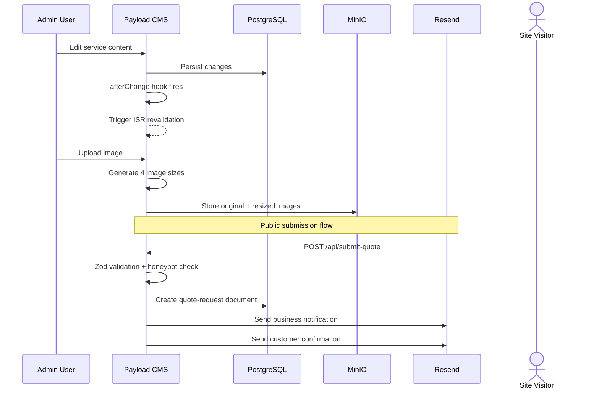

# Design Document: Payload CMS Backend

## Overview

This design describes the Payload CMS 3.x backend for the Xcel Locksmith website. The system replaces static TypeScript data files with an API-driven CMS, enabling content editing via an admin dashboard while leaving the existing React SPA frontend untouched.

The backend is a single Next.js 15 + Payload CMS 3.x application deployed on a Netcup VPS via Coolify. It connects to PostgreSQL for data persistence and MinIO for S3-compatible media storage, both running as Docker containers on the same network.

Key design decisions:
- **Content-only CMS**: Admins edit text, images, and content structure — not design, colors, fonts, or layout
- **Admin-only RBAC**: Single role with full access; multiple admin users supported
- **Additive layer**: The CMS backend is built alongside the existing SPA without modifying any frontend files
- **Monorepo structure**: `apps/cms/` for the backend, `apps/web/` reserved for future frontend port, `packages/shared/` for shared TypeScript types
- **Local API for future frontend**: Server Components will fetch data via Payload Local API with zero network overhead

## Architecture



### Data Flow



### Monorepo Structure

```
xcel-locksmith/
├── apps/
│   ├── cms/                          # Payload CMS + Next.js 15
│   │   ├── src/
│   │   │   ├── app/                  # Next.js App Router
│   │   │   │   ├── (payload)/        # Payload admin routes
│   │   │   │   │   └── admin/
│   │   │   │   ├── api/              # Custom API endpoints
│   │   │   │   │   └── submit-quote/
│   │   │   │   └── sitemap.xml/      # Dynamic sitemap route
│   │   │   ├── collections/          # Payload collection configs
│   │   │   ├── globals/              # Payload global configs
│   │   │   ├── hooks/                # Lifecycle hooks
│   │   │   ├── email/                # Email templates
│   │   │   ├── seed/                 # Seed script + data mappers
│   │   │   └── payload.config.ts     # Main Payload config
│   │   ├── .env.example
│   │   ├── next.config.mjs
│   │   ├── package.json
│   │   └── tsconfig.json
│   └── web/                          # Future Next.js frontend port
├── packages/
│   └── shared/                       # Shared TypeScript types
│       ├── src/
│       │   └── types/                # Collection/global type definitions
│       ├── package.json
│       └── tsconfig.json
├── package.json                      # Workspace root
└── turbo.json                        # Turborepo config (optional)
```

## Components and Interfaces

### Payload Collections (9 collections + 1 upload collection)

| Collection | Slug | Admin Group | Public Read | Public Create | Revalidation Hook |
|---|---|---|---|---|---|
| Media | `media` | Media | Yes | No | No |
| Service Categories | `service-categories` | Content | Yes | No | No |
| Services | `services` | Content | Yes | No | Yes — service pages |
| Service Areas | `service-areas` | Content | Yes | No | Yes — city pages + sitemap |
| Team Members | `team-members` | Content | Yes | No | No |
| Reviews | `reviews` | Content | Approved only | Yes | No |
| FAQs | `faqs` | Content | Yes | No | No |
| Gallery Items | `gallery-items` | Content | Yes | No | No |
| Quote Requests | `quote-requests` | Leads | No | Yes | No |
| Vehicle Makes | `vehicle-makes` | Vehicles | Yes | No | No |
| Vehicle Models | `vehicle-models` | Vehicles | Yes | No | No |
| Users | `users` | Admin | No | No | No |

### Payload Globals (3 globals)

| Global | Slug | Purpose |
|---|---|---|
| Site Settings | `site-settings` | Business name, contact info, hours, SEO defaults |
| Homepage Layout | `homepage-layout` | Section ordering, headings, visibility toggles |
| Navigation | `navigation` | Nav items with labels, hrefs, ordering |

### Custom API Endpoints

| Endpoint | Method | Auth | Purpose |
|---|---|---|---|
| `/api/submit-quote` | POST | Public | Zod-validated quote request submission with honeypot |

### Lifecycle Hooks

| Hook | Trigger | Action |
|---|---|---|
| `revalidateServicePages` | `services.afterChange` | Triggers ISR revalidation for the changed service page |
| `revalidateCityPages` | `service-areas.afterChange` | Triggers ISR revalidation for the changed city page |
| `regenerateSitemap` | `services/service-areas/service-categories.afterChange` | Triggers sitemap regeneration |
| `sendQuoteNotification` | `quote-requests.afterChange` (create) | Sends business + customer emails via Resend |
| `sendReviewNotification` | `reviews.afterChange` (create) | Sends admin notification email via Resend |
| `rejectHoneypot` | `quote-requests.beforeChange` (create) | Silently rejects submissions with filled honeypot |
| `autoGenerateSlug` | `services/service-categories/service-areas.beforeValidate` | Generates slug from name/title if not provided |

### Email Templates

| Template | Trigger | Recipients |
|---|---|---|
| `quote-request-business` | New quote request | Business admin email |
| `quote-request-customer` | New quote request (if email provided) | Customer email |
| `review-notification` | New review submitted | Business admin email |

### Access Control

All collections use admin-only write access:

```typescript
// Shared access control function
const isAuthenticated = ({ req }: { req: PayloadRequest }) => Boolean(req.user);

// Public read, admin write
const publicReadAdminWrite = {
  read: () => true,
  create: isAuthenticated,
  update: isAuthenticated,
  delete: isAuthenticated,
};

// Reviews: public read (approved only), public create, admin manage
const reviewsAccess = {
  read: ({ req }: { req: PayloadRequest }) =>
    req.user ? true : { isApproved: { equals: true } },
  create: () => true,
  update: isAuthenticated,
  delete: isAuthenticated,
};

// Quote requests: public create, admin read/manage
const quoteRequestsAccess = {
  read: isAuthenticated,
  create: () => true,
  update: isAuthenticated,
  delete: isAuthenticated,
};
```

## Data Models

### Users Collection

```typescript
{
  slug: 'users',
  auth: true,  // Enables Payload authentication
  fields: [
    // email and password provided by auth: true
    // No additional role field — all users are admins
  ]
}
```

### Media Collection

```typescript
{
  slug: 'media',
  upload: {
    imageSizes: [
      { name: 'thumbnail', width: 300, height: 300, position: 'centre' },
      { name: 'card', width: 600, height: 400, position: 'centre' },
      { name: 'hero', width: 1200, height: 600, position: 'centre' },
      { name: 'og', width: 1200, height: 630, position: 'centre' },
    ],
    mimeTypes: ['image/png', 'image/jpeg', 'image/webp', 'image/svg+xml', 'application/pdf'],
  },
  fields: [
    { name: 'alt', type: 'text', required: true },
    { name: 'caption', type: 'text' },
  ]
}
```

### Service Categories Collection

```typescript
{
  slug: 'service-categories',
  fields: [
    { name: 'name', type: 'text', required: true },
    { name: 'slug', type: 'text', unique: true, required: true },  // auto-generated from name
    { name: 'label', type: 'text' },
    { name: 'headline', type: 'text' },
    { name: 'description', type: 'textarea' },
    { name: 'seoTitle', type: 'text' },
    { name: 'seoDescription', type: 'textarea' },
    { name: 'heroImage', type: 'upload', relationTo: 'media' },
    { name: 'color', type: 'text' },
    { name: 'isActive', type: 'checkbox', defaultValue: true },
    { name: 'sortOrder', type: 'number' },
  ]
}
```

### Services Collection

```typescript
{
  slug: 'services',
  fields: [
    { name: 'title', type: 'text', required: true },
    { name: 'slug', type: 'text', unique: true, required: true },  // auto-generated from title
    { name: 'category', type: 'relationship', relationTo: 'service-categories', required: true },
    { name: 'shortDescription', type: 'textarea' },
    { name: 'longDescription', type: 'richText' },
    { name: 'startingPrice', type: 'text' },
    { name: 'icon', type: 'text' },  // Lucide icon name
    { name: 'heroImage', type: 'upload', relationTo: 'media' },
    { name: 'benefits', type: 'array', fields: [{ name: 'benefit', type: 'text' }] },
    { name: 'ctaText', type: 'text' },
    { name: 'seoTitle', type: 'text' },
    { name: 'seoDescription', type: 'textarea' },
    { name: 'isActive', type: 'checkbox', defaultValue: true },
    { name: 'sortOrder', type: 'number' },
  ]
}
```

### Service Areas Collection

```typescript
{
  slug: 'service-areas',
  fields: [
    { name: 'cityName', type: 'text', required: true },
    { name: 'slug', type: 'text', unique: true, required: true },
    { name: 'state', type: 'text', defaultValue: 'OH' },
    { name: 'lat', type: 'number', required: true },
    { name: 'lng', type: 'number', required: true },
    { name: 'radiusMiles', type: 'number', defaultValue: 5 },
    { name: 'responseTime', type: 'text', defaultValue: '20-30 min' },
    { name: 'seoTitle', type: 'text' },
    { name: 'seoDescription', type: 'textarea' },
    { name: 'isActive', type: 'checkbox', defaultValue: true },
    { name: 'sortOrder', type: 'number' },
  ]
}
```

### Team Members Collection

```typescript
{
  slug: 'team-members',
  fields: [
    { name: 'name', type: 'text', required: true },
    { name: 'role', type: 'text', required: true },
    { name: 'experience', type: 'text' },
    { name: 'bio', type: 'textarea' },
    { name: 'photo', type: 'upload', relationTo: 'media', required: true },
    { name: 'specialties', type: 'array', fields: [{ name: 'specialty', type: 'text' }] },
    { name: 'certifications', type: 'array', fields: [
      { name: 'name', type: 'text' },
      { name: 'file', type: 'upload', relationTo: 'media' },
      { name: 'fileType', type: 'select', options: ['image', 'pdf'] },
      { name: 'expiryDate', type: 'date' },
      { name: 'isVerified', type: 'checkbox', access: { update: isAuthenticated } },
    ]},
    { name: 'isActive', type: 'checkbox', defaultValue: true },
    { name: 'sortOrder', type: 'number' },
  ]
}
```

### Reviews Collection

```typescript
{
  slug: 'reviews',
  fields: [
    { name: 'customerName', type: 'text', required: true },
    { name: 'starRating', type: 'number', min: 1, max: 5, required: true },
    { name: 'reviewText', type: 'textarea', required: true },
    { name: 'reviewDate', type: 'date' },
    { name: 'source', type: 'select', options: ['website', 'google', 'yelp', 'manual'] },
    { name: 'isApproved', type: 'checkbox', defaultValue: false },
    { name: 'isFeatured', type: 'checkbox', defaultValue: false },
  ]
}
```

### FAQs Collection

```typescript
{
  slug: 'faqs',
  fields: [
    { name: 'question', type: 'text', required: true },
    { name: 'answer', type: 'richText', required: true },
    { name: 'category', type: 'select', options: ['general', 'pricing', 'services', 'emergency'] },
    { name: 'isActive', type: 'checkbox', defaultValue: true },
    { name: 'sortOrder', type: 'number' },
  ]
}
```

### Gallery Items Collection

```typescript
{
  slug: 'gallery-items',
  fields: [
    { name: 'title', type: 'text', required: true },
    { name: 'beforeImage', type: 'upload', relationTo: 'media', required: true },
    { name: 'afterImage', type: 'upload', relationTo: 'media', required: true },
    { name: 'description', type: 'textarea' },
    { name: 'service', type: 'relationship', relationTo: 'services' },
    { name: 'isActive', type: 'checkbox', defaultValue: true },
    { name: 'sortOrder', type: 'number' },
  ]
}
```

### Quote Requests Collection

```typescript
{
  slug: 'quote-requests',
  fields: [
    { name: 'name', type: 'text', required: true },
    { name: 'phone', type: 'text', required: true },
    { name: 'email', type: 'text' },
    { name: 'serviceType', type: 'select', options: ['residential', 'commercial', 'automotive'] },
    { name: 'service', type: 'relationship', relationTo: 'services' },
    { name: 'location', type: 'text' },
    { name: 'photo', type: 'upload', relationTo: 'media' },
    { name: 'notes', type: 'textarea' },
    { name: 'status', type: 'select', options: ['new', 'contacted', 'quoted', 'won', 'lost'], defaultValue: 'new' },
    { name: 'honeypot', type: 'text', admin: { hidden: true } },
  ]
}
```

### Vehicle Makes Collection

```typescript
{
  slug: 'vehicle-makes',
  fields: [
    { name: 'name', type: 'text', required: true },
    { name: 'logo', type: 'upload', relationTo: 'media' },
    { name: 'isActive', type: 'checkbox', defaultValue: true },
    { name: 'sortOrder', type: 'number' },
  ]
}
```

### Vehicle Models Collection

```typescript
{
  slug: 'vehicle-models',
  fields: [
    { name: 'name', type: 'text', required: true },
    { name: 'make', type: 'relationship', relationTo: 'vehicle-makes', required: true },
    { name: 'supportedServices', type: 'relationship', relationTo: 'services', hasMany: true },
    { name: 'isActive', type: 'checkbox', defaultValue: true },
  ]
}
```

### Site Settings Global

```typescript
{
  slug: 'site-settings',
  fields: [
    { name: 'businessName', type: 'text' },
    { name: 'tagline', type: 'text' },
    { name: 'logo', type: 'upload', relationTo: 'media' },
    { name: 'phone', type: 'text' },
    { name: 'email', type: 'text' },
    { name: 'address', type: 'group', fields: [
      { name: 'street', type: 'text' },
      { name: 'city', type: 'text' },
      { name: 'state', type: 'text' },
      { name: 'zip', type: 'text' },
    ]},
    { name: 'hours', type: 'array', fields: [
      { name: 'day', type: 'text' },
      { name: 'hours', type: 'text' },
    ]},
    { name: 'responseTime', type: 'text' },
    { name: 'defaultSeoTitle', type: 'text' },
    { name: 'defaultSeoDescription', type: 'textarea' },
    { name: 'analyticsId', type: 'text' },
  ]
}
```

### Homepage Layout Global

```typescript
{
  slug: 'homepage-layout',
  fields: [
    { name: 'sections', type: 'array', fields: [
      { name: 'sectionType', type: 'select', options: [
        'hero', 'services', 'reviews', 'gallery', 'quote',
        'vehicle-verifier', 'team', 'map', 'faq', 'contact', 'visitor-counter'
      ]},
      { name: 'heading', type: 'text' },
      { name: 'subheading', type: 'text' },
      { name: 'isActive', type: 'checkbox' },
      { name: 'sortOrder', type: 'number' },
    ]}
  ]
}
```

### Navigation Global

```typescript
{
  slug: 'navigation',
  fields: [
    { name: 'items', type: 'array', fields: [
      { name: 'label', type: 'text' },
      { name: 'href', type: 'text' },
      { name: 'isActive', type: 'checkbox' },
      { name: 'sortOrder', type: 'number' },
    ]}
  ]
}
```

### Sitemap Generation

The sitemap is generated as a Next.js App Router route at `app/sitemap.xml/route.ts`. It queries all active collections via the Payload Local API and builds an XML sitemap with the following priority scheme:

| Page Type | Priority | Source |
|---|---|---|
| Homepage | 1.0 | Static |
| Category pages | 0.9 | `service-categories` collection |
| Service pages | 0.8 | `services` collection |
| City pages | 0.8 | `service-areas` collection |
| Combo pages (future) | 0.7 | Cross-product of services × service-areas |

Each entry includes a `lastModified` timestamp from the document's `updatedAt` field.

### Seed Script Architecture

The seed script (`apps/cms/src/seed/index.ts`) runs as a Payload Local API script. It:

1. Checks for existing admin user; creates one if none exists
2. Reads static data from the existing `src/data/*.ts` files
3. For each collection, checks if a document with the same slug/identifier exists before creating (idempotent)
4. Uploads media files (certificates, gallery images, service hero images) to MinIO via the Media collection
5. Merges `services.ts` + `serviceDetails.ts` into unified service records
6. Populates all three globals from `siteConfig.ts`

Execution: `npx payload seed` or `npx tsx apps/cms/src/seed/index.ts`

### Quote Submission Endpoint

`POST /api/submit-quote` is a Next.js API route that:

1. Parses the request body with a Zod schema
2. Checks the honeypot field — if non-empty, returns `200 OK` silently (no document created)
3. Creates a `quote-requests` document via the Payload Local API
4. The `afterChange` hook on the collection handles email notifications
5. Returns `201 Created` with the document ID on success

```typescript
// Zod schema for quote submission
const quoteSchema = z.object({
  name: z.string().min(1),
  phone: z.string().min(1),
  email: z.string().email().optional(),
  serviceType: z.enum(['residential', 'commercial', 'automotive']).optional(),
  service: z.string().optional(),  // service ID
  location: z.string().optional(),
  notes: z.string().optional(),
  honeypot: z.string().optional(),
});
```


## Correctness Properties

*A property is a characteristic or behavior that should hold true across all valid executions of a system — essentially, a formal statement about what the system should do. Properties serve as the bridge between human-readable specifications and machine-verifiable correctness guarantees.*

### Property 1: Slug auto-generation

*For any* service category name or service title, if the slug field is omitted during creation or update, the resulting document's slug should be a URL-safe, lowercase, hyphenated transformation of the name/title field, and it should be deterministic (same input always produces same slug).

**Validates: Requirements 4.2, 5.2**

### Property 2: Collection access control enforcement

*For any* collection configured with public-read/admin-write access (media, services, service-categories, service-areas, team-members, faqs, gallery-items, vehicle-makes, vehicle-models), an unauthenticated request should succeed for read operations and fail for create/update/delete operations. For quote-requests, unauthenticated create should succeed but read/update/delete should fail. For reviews, unauthenticated create should succeed.

**Validates: Requirements 2.3, 3.5, 5.3, 8.2, 11.2**

### Property 3: Reviews return only approved documents for public queries

*For any* set of reviews with mixed `isApproved` values, an unauthenticated query to the reviews collection should return only documents where `isApproved` is true. An authenticated query should return all documents regardless of approval status.

**Validates: Requirements 8.3**

### Property 4: Honeypot silently rejects spam submissions

*For any* quote request submission where the `honeypot` field contains a non-empty string, the system should return a 200 OK response and should not create a document in the quote-requests collection.

**Validates: Requirements 11.3**

### Property 5: Quote endpoint validates input via Zod schema

*For any* request body sent to `POST /api/submit-quote`, if the body fails Zod validation (missing required `name` or `phone`, invalid `email` format, invalid `serviceType` enum value), the endpoint should reject the request with a validation error and not create a document.

**Validates: Requirements 11.5**

### Property 6: Revalidation hooks fire on content changes

*For any* document change (create, update, delete) in the services, service-areas, or service-categories collections, the corresponding revalidation hook should be invoked, triggering ISR page regeneration for the affected pages and sitemap regeneration.

**Validates: Requirements 5.4, 6.2, 14.4**

### Property 7: Quote request triggers correct email notifications

*For any* valid quote request creation, the system should send a notification email to the business email address. Additionally, if the quote request includes a customer email address, the system should also send a confirmation email to that customer address. If no customer email is provided, only the business notification should be sent.

**Validates: Requirements 11.4, 16.1, 16.2**

### Property 8: Email failures do not break parent operations

*For any* email send operation that fails (Resend API error), the parent operation (quote request creation or review creation) should still complete successfully, and the error should be logged.

**Validates: Requirements 16.5**

### Property 9: Sitemap includes all active documents

*For any* set of active services, service categories, and service areas in the database, the generated sitemap XML should contain a URL entry for each active document. Inactive documents (where `isActive` is false) should not appear in the sitemap.

**Validates: Requirements 14.1**

### Property 10: Sitemap entries have correct priority and lastModified

*For any* sitemap entry, the priority should match the page type (homepage=1.0, categories=0.9, services=0.8, cities=0.8), and the `lastModified` timestamp should equal the `updatedAt` field of the corresponding document.

**Validates: Requirements 14.2, 14.3**

### Property 11: Media upload produces all configured image sizes

*For any* uploaded image file (png, jpeg, webp), the system should generate exactly four resized variants: thumbnail (300×300), card (600×400), hero (1200×600), and og (1200×630). SVGs and PDFs should be stored without image resizing.

**Validates: Requirements 3.2**

### Property 12: Media validates MIME type and requires alt text

*For any* file upload attempt, the system should accept only files with MIME types in the allowed set (image/png, image/jpeg, image/webp, image/svg+xml, application/pdf) and reject all others. Additionally, for any media creation, omitting the `alt` field should fail validation.

**Validates: Requirements 3.3, 3.4**

### Property 13: Seed script is idempotent

*For any* database state, running the seed script twice should produce the same final state as running it once. The second execution should skip all records that already exist (matched by slug or unique identifier) and not create duplicates.

**Validates: Requirements 17.7**

### Property 14: Seed script merges service data correctly

*For any* service slug that exists in both `services.ts` and `serviceDetails.ts`, the seeded service document should contain fields from both sources: summary fields (title, slug, category, shortDescription, startingPrice, icon) from `services.ts` and detail fields (longDescription, benefits, ctaText) from `serviceDetails.ts`.

**Validates: Requirements 17.4**

### Property 15: Review creation triggers admin notification

*For any* new review creation (regardless of source or content), the system should send an email notification to the business admin email address.

**Validates: Requirements 8.4, 16.3**

## Error Handling

### Email Delivery Failures

Email operations (quote notifications, review notifications) are non-blocking. If the Resend API returns an error:
- The error is logged with full context (template name, recipient, error message)
- The parent operation (document creation) completes successfully
- No retry mechanism in the initial build — failed emails are logged for manual follow-up

### Honeypot Spam Rejection

When a quote submission includes a non-empty honeypot field:
- The endpoint returns `200 OK` with a generic success response (to avoid tipping off bots)
- No document is created in the database
- No emails are sent
- The rejection is logged for monitoring

### Zod Validation Errors

The `/api/submit-quote` endpoint validates all input before processing:
- Invalid requests receive a `400 Bad Request` response with field-level error messages
- The response format matches Zod's error output for easy frontend consumption
- No partial documents are created on validation failure

### Media Upload Errors

- Files exceeding size limits or with disallowed MIME types are rejected with descriptive error messages
- Image resizing failures (e.g., corrupt files) are logged, and the original file is still stored
- S3/MinIO connection failures return a `500` error with a logged stack trace

### Database Connection Errors

- Payload's built-in connection pooling handles transient PostgreSQL failures
- The application logs connection errors and returns `503 Service Unavailable` for API requests during outages

### Seed Script Error Handling

- The seed script wraps each collection's seeding in a try/catch block
- Individual record failures are logged but don't halt the entire seeding process
- Media upload failures during seeding are logged with the file path for manual retry
- The script outputs a summary of created, skipped, and failed records

### Access Control Violations

- Unauthenticated write attempts to protected collections return `401 Unauthorized`
- Payload's built-in access control handles all authorization checks consistently
- No sensitive error details are leaked in unauthorized responses

## Testing Strategy

### Dual Testing Approach

This project uses both unit tests and property-based tests for comprehensive coverage:

- **Unit tests**: Verify specific examples, edge cases, integration points, and seed data correctness
- **Property-based tests**: Verify universal properties across randomly generated inputs

### Property-Based Testing Configuration

- **Library**: [fast-check](https://github.com/dubzzz/fast-check) for TypeScript/JavaScript
- **Minimum iterations**: 100 per property test
- **Tag format**: Each test is annotated with a comment referencing the design property:
  ```
  // Feature: payload-cms-backend, Property N: <property title>
  ```
- Each correctness property is implemented by a single property-based test

### Unit Test Scope

Unit tests cover:
- Seed script output verification (correct counts: 3 categories, 29 services, 24 areas, etc.)
- Seed script data integrity (seeded reviews have `isApproved: true`, globals populated from `siteConfig.ts`)
- Collection schema validation (required fields, default values, field types)
- Email template rendering (correct HTML output for each template type)
- Admin dashboard stats computation (aggregate queries return correct values)
- Sitemap XML structure (valid XML, correct namespace, well-formed URLs)

### Property Test Scope

Property tests cover all 15 correctness properties defined above, focusing on:
- Slug generation determinism and URL-safety across random inputs
- Access control enforcement across all collections and auth states
- Reviews filtering by approval status across random review sets
- Honeypot rejection across random non-empty honeypot values
- Zod validation across random valid and invalid request bodies
- Revalidation hook invocation across random document changes
- Email notification logic across random quote/review data
- Email failure resilience across simulated API errors
- Sitemap completeness and metadata correctness across random document sets
- Media validation across random file types and metadata
- Seed script idempotency via double-execution comparison
- Service data merge correctness across all 29 service slugs

### Test Infrastructure

- Tests run against an in-memory or test PostgreSQL instance
- MinIO interactions are mocked for unit tests, tested against a real instance for integration tests
- Resend API calls are mocked in all tests
- Payload Local API is used for integration tests to verify end-to-end behavior
- Test runner: Vitest (consistent with the existing frontend test setup)
